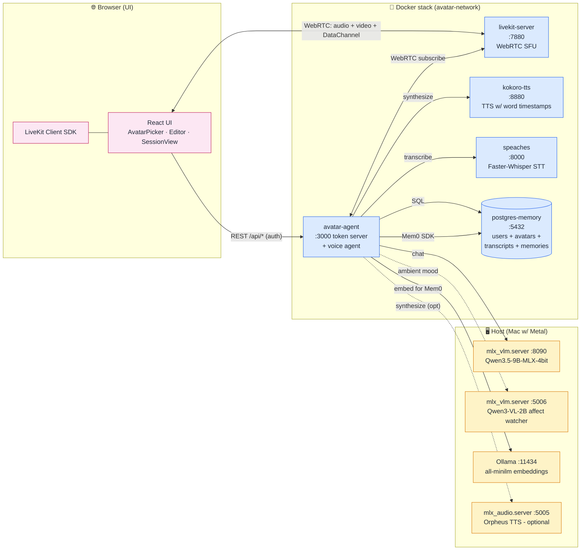
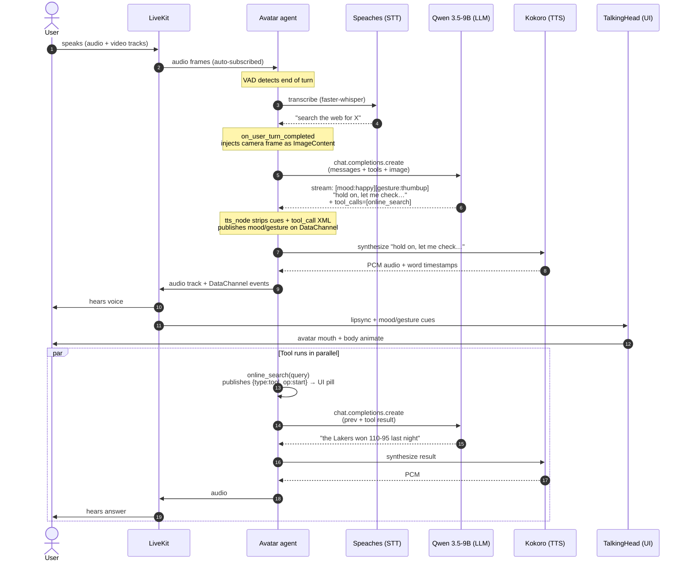
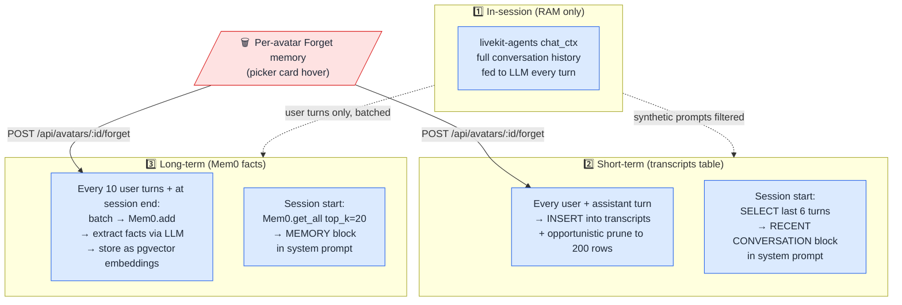
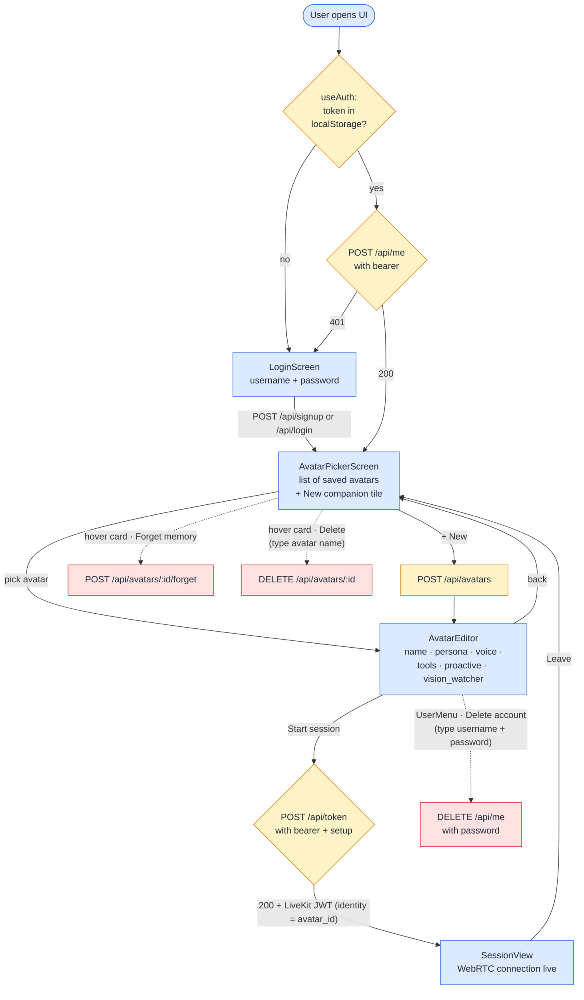

# Avatar — Real-time Voice Companion

A fully local, real-time speech-to-speech voice agent built on LiveKit. The name nods to the Hollywood craft of Avatar: dubbing voice and sound onto a face that's already moving — which is literally what the lipsync + TTS pipeline does. The default persona ships as **Liva** but is fully configurable per session — name, persona, voice, avatar, tools.

> **What's in the box:** auth + multi-user, per-avatar long-term memory (Mem0), short-term cross-session recall (transcripts), 3D animated avatar with lip sync, vision-driven affect (camera mood detection), proactive utterances (avatar breaks silence), function-call tools with live UI feedback, password-reconfirmed account delete, persona prompt-injection defense, and per-avatar Forget Memory.

**Stack:** Qwen 3.5-9B (MLX, runs on Metal) for chat · Kokoro / Orpheus / Supertonic for TTS · Faster-Whisper for STT · Mem0 + pgvector for memory · LiveKit for WebRTC signaling · React + TalkingHead.js for the avatar UI.

---

## System Overview



The agent runs in Docker but reaches MLX servers on the host via `host.docker.internal` — Docker on macOS can't see Metal, so MLX inference must run natively. Browser → LiveKit is plain WebRTC; everything else is REST or SQL.

---

## A conversation turn

The hot path from the moment the user stops speaking to the moment audio reaches their ears:



**Latency budget on M4 Pro (warm cache):** STT ≈ 200–500 ms · LLM TTFT ≈ 1–3 s · TTS TTFB ≈ 300–600 ms · End-to-end ≈ 2–5 s for a typical reply. Vision frames add ~50 ms when injected. Memory recall (Mem0) ≈ 1–10 ms (pgvector index).

---

## Memory: three layers

Avatar has three independent memory layers per avatar, each with its own storage and lifecycle:



| Layer | Use | Lifetime | Wiped by |
|---|---|---|---|
| **chat_ctx** | full transcript while session is alive — fed to every LLM call | session | session end |
| **transcripts** | "we were just talking about X" cross-session recency (verbatim) | persistent, capped at 200/avatar | Forget memory · delete avatar |
| **Mem0** | distilled facts ("user owns a V8 Challenger") for cross-session knowledge | persistent | Forget memory · delete avatar |

**Synthetic prompts** (the initial greeting kickoff and any ProactiveSpeaker SYS-NUDGE messages) are filtered from layers 2 and 3 by `is_synthetic_user_message()` so they never poison future-session recall.

---

## Auth + session lifecycle



**Two-token model:** the **session JWT** (long-lived, signed with `JWT_SECRET`, stored as `liva-session-token` in localStorage) is exchanged at `/api/token` for a **LiveKit token** (short-lived, room-scoped, identity = avatar_id). The LiveKit token never persists — it's used once to join, then discarded.

**Hard-edge security:** account delete (`DELETE /api/me`) re-verifies the password against bcrypt — a stolen JWT alone can't nuke the account. The picker's UserMenu deliberately doesn't expose Delete account; the only canonical path is through the editor's UserMenu (which has the password modal).

---

## Quick start

### 1. Host-side dependencies (one-time, macOS)

MLX servers run natively on the Mac so they can use Metal:

```bash
# Chat LLM + ambient affect VLM (mlx-vlm is a superset of mlx-lm)
uv tool install --with 'uvicorn[standard]' --with fastapi \
  --with python-multipart --with torch --with torchvision mlx-vlm

# Optional: Orpheus TTS (mlx-audio + Metal)
uv tool install --with 'uvicorn[standard]' --with fastapi \
  --with python-multipart --with webrtcvad-wheels mlx-audio

# Embeddings (Ollama, host service)
brew install ollama   # or download the macOS app
ollama pull all-minilm   # ~46 MB MiniLM embeddings (384-dim)
```

### 2. Configure env

```bash
cp .env.example .env
# Generate JWT_SECRET: python -c "import secrets; print(secrets.token_urlsafe(64))"
# Edit JWT_SECRET in .env
```

### 3. Bring up the stack

```bash
# Recommended: starts host MLX + Docker stack in the right order
./run.sh start

# Add Orpheus TTS:
ORPHEUS=1 ./run.sh start

# Just Docker (Kokoro-only):
docker-compose up --build
```

UI at `http://localhost:3000`. Sign up with a username + password, create a companion, talk.

### Common commands

```bash
./run.sh status            # health check on every service
./run.sh logs              # tail all logs
./run.sh restart           # full restart
docker-compose logs agent  # just the agent
cd ui && npm run dev       # Vite hot-reload UI on :5173 (proxies to :3000)
cd ui && npm run typecheck # TS check, no emit
python benchmark.py --rounds 5  # latency benchmark
```

---

## Environment variables

The minimum set you need to set in `.env`:

| Variable | What it does |
|---|---|
| `LIVEKIT_URL` / `LIVEKIT_API_KEY` / `LIVEKIT_API_SECRET` | WebRTC signaling. Defaults work with `livekit-server --dev`. |
| `LLM_BASE_URL` / `LLM_API_KEY` / `LLM_MODEL` | OpenAI-compatible chat LLM. Defaults to host `mlx_vlm.server :8090`. |
| `TTS_BASE_URL` | Kokoro TTS (default `http://kokoro-tts:8880` in the docker network). |
| `STT_BASE_URL` | Speaches / Faster-Whisper (default `http://speaches:8000/v1`). |
| `JWT_SECRET` | HS256 signing key for session tokens. **Required.** Generate with `python -c "import secrets; print(secrets.token_urlsafe(64))"`. |
| `DEV=1` | Acknowledges that LiveKit dev creds (`devkey`/`secret`) are intentional. **Required for localhost; remove before non-localhost deploy.** |

Common optional:

| Variable | What it does |
|---|---|
| `ORPHEUS_BASE_URL` / `ORPHEUS_MODEL` | Enable Orpheus TTS as a second voice backend. |
| `SUPERTONIC_BASE_URL` / `SUPERTONIC_MODEL` | Enable Supertonic TTS (44.1 kHz, multilingual styles) as a third voice backend. |
| `VLM_BASE_URL` / `VLM_MODEL` | Ambient-affect watcher (Qwen3-VL-2B). When unset, no camera mood detection. |
| `MEM0_PG_HOST` + `MEM0_PG_*` | Long-term memory. When `MEM0_PG_HOST` unset, falls back to NullProvider (no memory). |
| `MEM0_LLM_*` / `MEM0_EMBEDDER_*` | Override Mem0's extraction LLM and embedder. |
| `LK_OPENAI_DEBUG=1` | Log every chat.completions.create payload (debug only — verbose). |
| `LOG_USER_TEXT=1` | Inline full user/assistant text in logs (default redacts to first 40 chars). |

See `.env.example` for full documentation of every variable.

---

## License

Avatar is released under the [MIT License](LICENSE) — copyright © 2026 Kirouane Ayoub. Use it, fork it, ship it, sell it; just keep the copyright + license notice with redistributions and don't expect a warranty.

This repository **bundles or runs against** several open-source components, each governed by its own license — they are NOT covered by Avatar's MIT grant. The table below was verified against each upstream repo's LICENSE file (via `gh api repos/<owner>/<repo>/license`) and each Hugging Face model card on **2026-05-03**; check the upstream sources before any commercial redistribution since licenses can be re-licensed.

**Code / SDKs:**

| Project | License (verified) |
|---|---|
| [livekit/livekit](https://github.com/livekit/livekit) — WebRTC SFU | Apache-2.0 |
| [livekit/agents](https://github.com/livekit/agents) — Agents Python SDK | Apache-2.0 |
| [mem0ai/mem0](https://github.com/mem0ai/mem0) — long-term memory | Apache-2.0 |
| [remsky/Kokoro-FastAPI](https://github.com/remsky/Kokoro-FastAPI) — TTS server | Apache-2.0 |
| [canopyai/Orpheus-TTS](https://github.com/canopyai/Orpheus-TTS) — alt TTS (optional) | Apache-2.0 |
| [Blaizzy/mlx-vlm](https://github.com/Blaizzy/mlx-vlm) — chat LLM + ambient VLM server | MIT |
| [Blaizzy/mlx-audio](https://github.com/Blaizzy/mlx-audio) — Orpheus runtime | MIT |
| [SYSTRAN/faster-whisper](https://github.com/SYSTRAN/faster-whisper) — STT engine | MIT |
| [speaches-ai/speaches](https://github.com/speaches-ai/speaches) — Whisper HTTP server | MIT |
| [met4citizen/TalkingHead](https://github.com/met4citizen/TalkingHead) — 3D avatar + lipsync | MIT |
| [ollama/ollama](https://github.com/ollama/ollama) — embeddings server | MIT |
| [pgvector/pgvector](https://github.com/pgvector/pgvector) — vector index | PostgreSQL License (BSD-style) |

**Model weights** (downloaded on first use; check the model card if you re-distribute):

| Model | License (per HF model card) |
|---|---|
| [`mlx-community/Qwen3.5-9B-MLX-4bit`](https://huggingface.co/mlx-community/Qwen3.5-9B-MLX-4bit) — chat LLM | Apache-2.0 |
| [`mlx-community/Qwen3-VL-2B-Instruct-4bit`](https://huggingface.co/mlx-community/Qwen3-VL-2B-Instruct-4bit) — affect VLM | Apache-2.0 |
| [`hexgrad/Kokoro-82M`](https://huggingface.co/hexgrad/Kokoro-82M) — TTS weights | Apache-2.0 |
| [`mlx-community/orpheus-3b-0.1-ft-4bit`](https://huggingface.co/mlx-community/orpheus-3b-0.1-ft-4bit) — Orpheus weights | Apache-2.0 |
| [`sentence-transformers/all-MiniLM-L6-v2`](https://huggingface.co/sentence-transformers/all-MiniLM-L6-v2) — embeddings (via Ollama as `all-minilm`) | Apache-2.0 |
